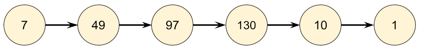
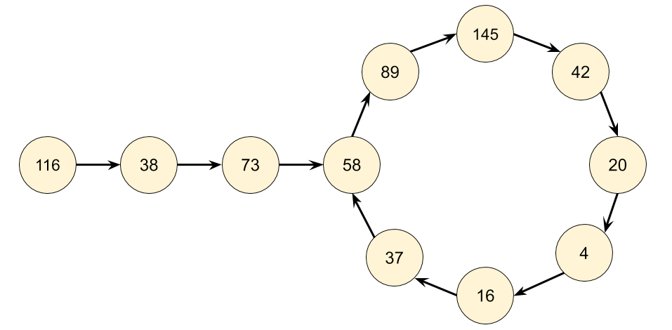

[202. Happy Number](https://leetcode.com/problems/happy-number/description/)


---

## 📝 Description

Write an algorithm to determine if a number n is happy.

A happy number is a number defined by the following process:

Starting with any positive integer, replace the number by the sum of the squares of its digits.
Repeat the process until the number equals 1 (where it will stay), or it loops endlessly in a cycle which does not include 1.
Those numbers for which this process ends in 1 are happy.

Return true if n is a happy number, and false if not.


Example 1:
- Input: n = 19
- Output: true
- Explanation:

    1² + 9² = 82
    
    8² + 2² = 68
    
    6² + 8² = 100 
    
    1² + 0² + 0² = 1 


Example 2:
- Input: n = 2
- Output: false


---

## 💡 Solution

### Logic 
这道题目看上去貌似一道数学问题，其实并不是！

题目中说了会 无限循环，那么也就是说求和的过程中，sum会**重复出现**，这对解题很重要！

True:


False:


### Complexity Analysis

#### Time: O(nlogn) 或者 O(logn⋅logn) = $O(log^2n)$

每次调用 getSumOfSquares 都是 O(log n)，因为一个数的位数是 log₁₀n ≈ log n。

时间复杂度分析：O(log n) × 迭代次数。

- 如果不想证明，可以近似迭代次数最大值为`n`。 得到Time Complexity O(nlogn) 。

- 如果证明：

  迭代停止直到：
  - 结果变成 1 (Converge)
  - 出现循环 (通过数学也可以求出Converge)


**Proof:** 

For integer `n` with `d` digits, let the sum of its squared digits be `s(n)`.

The maximum value for `s(n)` is when all digits in `n` is $9$, then $s(n) \leq 9^2\cdot d$.

The smallest number for `n` with `d` digits is $10^{d-1} \leq n$, which is equivalent to $d \leq (log_{10}{n})+1$.

Therefore, $s(n) \leq 9^2\cdot d \leq 81log_{10}{n} + 81 = O(log_{10}n)$, which is why cyclic repetitions appear.
**QED**.


To visualize the convergence, see the following table:

| d  | 81 × d | 10^(d−1)  | Inequality 81 × d < 10^(d−1) |
|----|--------|------------|----------------------|
| 1  | 81     | 1          | ❌ False              |
| 2  | 162    | 10         | ❌ False              |
| 3  | 243    | 100        | ❌ False              |
| 4  | 324    | 1,000      | ✅ True               |
| 5  | 405    | 10,000     | ✅ True               |
| 6  | 486    | 100,000    | ✅ True               |
| 7  | 567    | 1,000,000  | ✅ True               |

For example, for number with 4 digits, $s(9999) < 1000$, so the sum of its squared digits has maximum 324 options.


#### Space: O(nlogn) 或者 O(logn⋅logn) = $O(log^2n)$

Maximum size for the set created

---

## 🔍 Code

```python
def isHappy(self, n: int) -> bool:
    set_sum = set()
    while True:
        n = getSumOfSquares(n)
        if n == 1: 
            return True
        if n in set_sum: 
            return False
        else: 
            set_sum.add(n)
        
def getSumOfSquares(n):
    sum_squares = 0
    while n != 0:
        sum_squares += (n % 10) ** 2 # add squares
        n = n // 10
    return sum_squares
```


