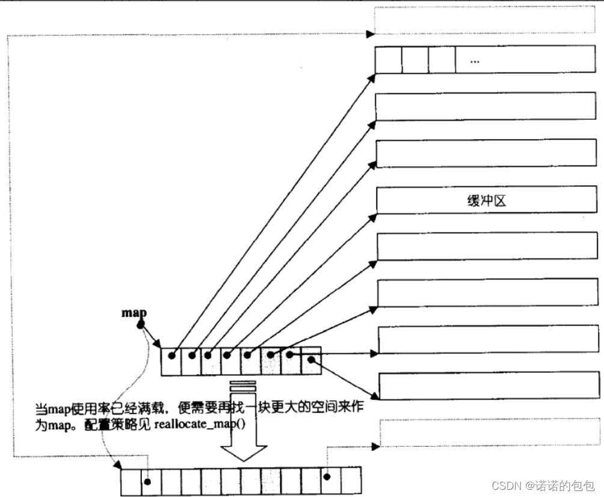
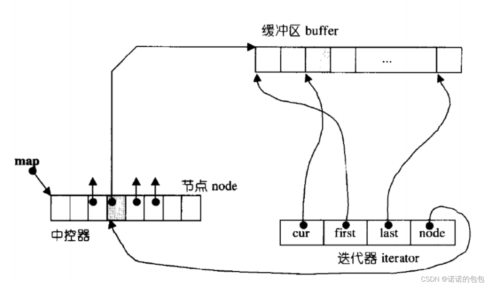

# 栈与队列 Stack and Queue


## 1. 基础知识

### 1.1 总结
以下是以C++为例，使用其他编程语言的同学也对应思考一下，自己使用的编程语言里栈和队列是什么样的。

1. C++中stack 是容器么？ -- 不是，是container adapter（容器适配器）
2. 我们使用的stack是属于哪个版本的STL？-- SGI STIL
3. 我们使用的STL中stack是如何实现的？ -- 数组或链表
4. stack 提供迭代器来遍历stack空间么？ -- 不提供，也不提供traversal（走访）功能


### 1.2 常见C++标准库

首先大家要知道`栈`和`队列`是STL（C++标准库）里面的两个数据结构。

C++标准库是有多个版本的，要知道我们使用的STL是哪个版本，才能知道对应的栈和队列的实现原理。

那么来介绍一下，三个最为普遍的STL版本：

1. HP STL 其他版本的C++ STL，一般是以HP STL为蓝本实现出来的，HP STL是C++ STL的第一个实现版本，而且开放源代码。

2. P.J.Plauger STL 由P.J.Plauger参照HP STL实现出来的，被Visual C++编译器所采用，不是开源的。

3. SGI STL 由Silicon Graphics Computer Systems公司参照HP STL实现，被Linux的C++编译器GCC所采用，SGI STL是开源软件，源码可读性甚高。


```text
什么是iterator? （python版本）

凡是可作用于for循环的对象都是Iterable类型；
凡是可作用于next()函数的对象都是Iterator类型，它们表示一个惰性计算的序列；
集合数据类型如list、dict、str等是Iterable但不是Iterator，不过可以通过iter()函数获得一个Iterator对象。

----

我们已经知道，可以直接作用于for循环的数据类型有以下几种：
一类是集合数据类型，如list、tuple、dict、set、str等；
一类是generator，包括生成器和带yield的generator function。
这些可以直接作用于for循环的对象统称为可迭代对象：Iterable。

而生成器不但可以作用于for循环，还可以被next()函数不断调用并返回下一个值，直到最后抛出StopIteration错误表示无法继续返回下一个值了。
可以被next()函数调用并不断返回下一个值的对象称为迭代器：Iterator。

生成器都是Iterator对象，但list、dict、str虽然是Iterable，却不是Iterator。

你可能会问，为什么list、dict、str等数据类型不是Iterator？
这是因为Python的Iterator对象表示的是一个数据流，Iterator对象可以被next()函数调用并不断返回下一个数据，直到没有数据时抛出StopIteration错误。可以把这个数据流看做是一个有序序列，但我们却不能提前知道序列的长度，只能不断通过next()函数实现按需计算下一个数据，所以Iterator的计算是惰性的，只有在需要返回下一个数据时它才会计算。
Iterator甚至可以表示一个无限大的数据流，例如全体自然数。而使用list是永远不可能存储全体自然数的。
```


```text
什么是适配器 Adapter？ 

适配器（也称之为配接器adapter）作为STL的六大组件之一，在STL中同样扮演轴承、转换器的角色。
adapter这个概念实际上是一种设计模式：将一个class的接口转化为另一个class的接口，使原本因接口不兼容而不能合作的classes可以一起合作。
就比如马上就要讲的，stack的相关操作底层实际上是调用了deque的对应的函数接口，或者queue的相关操作我们也可以实现成在底层调用list的对应的接口。

具有这种将一个类的接口转化成客户想要的另一个类的接口的性质的，我们称之为适配器（配接器）。本质上，一个适配器是一种机制，能使某种事物的行为看起来像另外一种事物一样。

```

```text
适配器分类

在STL所提供的各种适配器中，
改变仿函数接口者，我们称之为函数适配器（function adapter）；
改变容器接口者称之为：容器适配器（container adapter；
改变迭代器接口者，称之为迭代器适配器（iterator adapter）。

一个容器适配器（Container adaptors）接受一种已有的容器类型，使其行为看起来像一种不同的类型。
标准库定义了三个序列容器适配器：stack、queue和priority_queue。
```


### 1.3 Stack的实现

| Method   | Description                                     | Time Complexity |
| -------- | ----------------------------------------------- | --------------- |
| `push()` | Push an element onto the stack (add to the top) | $O(1)$          |
| `pop()`  | Pop the top element from the stack              | $O(1)$          |
| `peek()` | Access the top element of the stack             | $O(1)$          |


栈提供 `push` 和 `pop` 等等接口，所有元素必须符合**先进后出**规则，所以栈不提供**走访功能**(Traversal)，也不提供**迭代器**(Iterator)。 不像是set 或者map 提供迭代器iterator来遍历所有元素。

栈是以底层容器完成其所有的工作，对外提供统一的接口，底层容器是可插拔的（也就是说我们可以控制使用哪种容器来实现栈的功能）。 所以STL中栈往往不被归类为容器，而被**归类为container adapter（容器适配器）**。

栈的内部结构，栈的底层实现可以是vector，deque，list 都是可以的， 主要就是**数组和链表**的底层实现。


我们常用的SGI STL，如果没有指定底层实现的话，默认是以**deque**为缺省情况下栈的底层结构。deque是一个双向队列，只要封住一段，只开通另一端就可以实现栈的逻辑了。

stack是以deque作为其底层容器，也就是说，stack的push、pop、top等相关操作，其实底层都是调用的deque的相关接口，这也是为什么stack被归类为**适配器**而非容器的原因所在。

```text
作为栈的底层容器必须要支持以下几个操作：

empty        ： 判空
size            ：有效元素个数
back           ：尾部元素
push_back ：尾插
pop_back   ：尾删
因此，诸如vector、list都可以作为其底层容器
```

我们也可以指定**vector**为栈的底层实现，初始化语句如下：

```cpp
std::stack<int, std::vector<int> > third;  // 使用vector为底层容器的栈
```


### 1.4 Queue的实现

| Method Name | Description                            | Time Complexity |
| ----------- | -------------------------------------- | --------------- |
| `push()`    | Enqueue an element, add it to the tail | $O(1)$          |
| `pop()`     | Dequeue the head element               | $O(1)$          |
| `peek()`    | Access the head element                | $O(1)$          |


队列中先进先出的数据结构，同样**不允许有遍历行为，不提供迭代器**, SGI STL中队列一样是以**deque**为缺省情况下的底部结构。

所以STL 队列也不被归类为容器，而被归类为container adapter（容器适配器）。

```text
要作为queue的底层容器，必须要具有以下几个接口：

empty         ：判断是否空
size            ：有效元素个数
front           ：获取头部元素
back           ：获取尾部元素
push_back ：尾插
pop_front    ：头删
```

也可以指定**list** 为起底层实现，初始化queue的语句如下：

```cpp
std::queue<int, std::list<int>> third; // 定义以list为底层容器的队列
```

### 1.5 Deque相关知识

```text
为什么采用deque作为stack与queue的默认底层容器？

deque是一个双端队列，可以实现在头尾两端的相关操作，并且在头尾两端的操作十分高效。
与vector相比，vector虽然也可以实现在头部的操作，但实现起来比较复杂，要挪动后面的所有元素;
而与list相比，由于其底层空间是连续空间，所以空间利用率要高于list，并且list不支持下标的随机访问，而deque则支持。

deque作为其默认底层容器，完美的避开了deque的所有缺点，而又很好的利用了其优点。

首先，deque的两端操作都很高效，达到了O(1)的时间复杂度，再接着deque的扩容也要比vector更加高效，并且空间由于是连续的，所以空间利用率要高于list。
虽然说deque的遍历，以及在中间位置相关操作的效率不如list与vector，但是stack与queue并不需要遍历的相关操作，也不需要在中间位置插入删除，仅仅只需要其两端操作。
```


| Method Name   | Description                 | Time Complexity |
| ------------- | --------------------------- |----------------|
| `pushFirst()` | Add an element to the head | $O(1)$         |
| `pushLast()`  | Add an element to the tail  | $O(1)$         |
| `popFirst()`  | Remove the first element    | $O(1)$         |
| `popLast()`   | Remove the last element     | $O(1)$         |
| `peekFirst()` | Access the first element    | $O(1)$         |
| `peekLast()`  | Access the last element     | $O(1)$         |

#### 存储机制

deque由一段一段登场的连续空间构成，不同空间之间不一定连续。
为了管理空间，建立一个名为map数组作为中控器存储不同空间的首地址。也就是说，map存放指针，指向各个连续空间。
通过建立 map 数组，deque 容器申请的这些分段的连续空间就能实现“整体连续”的效果。

deque 容器的分段存储结构，提高了在序列两端添加或删除元素的效率，但也使该容器迭代器的底层实现变得更复杂。

Deque 最大的工作就是维护这些分段连续的内存空间的整体性的假象，并提供随机存取的接口，避开了重新配置空间，复制，释放的轮回，代价就是复杂的迭代器架构。

以下为 deque 容器的定义：
```cpp
//_Alloc为内存分配器
template<class _Ty, class _Alloc = allocator<_Ty>>
class deque{
    ...
protected:
    iterator start;
    iterator finish;
    map_pointer map;
...
}
```
- map数组作为中控器存储不同空间的首地址。
- start 迭代器记录着 map 数组中首个连续空间的信息，
- finish 迭代器记录着 map 数组中最后一个连续空间的信息。


另外需要注意的是，和普通 deque 迭代器不同，start 迭代器中的 cur 指针指向的是连续空间中首个元素；
而 finish 迭代器中的 cur 指针指向的是连续空间最后一个元素的下一个位置。

<p align="center">  </p>


#### 扩容机制
当 deque 容器需要在头部或尾部增加存储空间时，它会申请一段新的连续空间，同时在 map 数组的开头或结尾添加指向该空间的指针，由此该空间就串接到了 deque 容器的头部或尾部。

如果 map 数组满了怎么办？
很简单，再申请一块更大的连续空间供 map 数组使用，将原有数据（很多指针）拷贝到新的 map 数组中，然后释放旧的空间。


#### 迭代器机制

由于 deque 容器底层将序列中的元素分别存储到了不同段的连续空间中，因此要想实现迭代器的功能，必须先解决如下 2 个问题：

1. 迭代器在遍历 deque 容器时，必须能够确认各个连续空间在 map 数组中的位置；
2. 迭代器在遍历某个具体的连续空间时，必须能够判断自己是否已经处于空间的边缘位置。如果是，则一旦前进或者后退，就需要跳跃到上一个或者下一个连续空间中。

为了实现遍历 deque 容器的功能，deque 迭代器定义了如下的结构：
```cpp
template<class T,...>
struct __deque_iterator{
    ...
    T* cur;
    T* first;
    T* last;
    map_pointer node;//map_pointer 等价于 T**
}
```
可以看到，迭代器内部包含 4 个指针，它们各自的作用为：
- cur：指向当前正在遍历的元素；
- first：指向当前连续空间的首地址；
- last：指向当前连续空间的末尾地址；
- node：它是一个二级指针，用于指向 map 数组中存储的指向当前连续空间的指针。

<p align="center">  </p>


## 2. 题型


## 3. 思路


## 4.题目

### 4.1 Basics

#### [232. Implement Queue using Stacks用栈实现队列](https://leetcode.com/problems/implement-queue-using-stacks/description/)


#### [225. Implement Stack using Queues用队列实现栈](https://leetcode.com/problems/implement-stack-using-queues/)


### 4.2 Statck Applications
Stack很适合相邻元素的消消乐

#### [20. Valid Parentheses有效的括号](https://leetcode.com/problems/valid-parentheses/description/) - Easy
遇到匹配左右括号 进行消除

#### [1047. Remove All Adjacent Duplicates In String删除字符串中的所有相邻重复项 ](https://leetcode.com/problems/remove-all-adjacent-duplicates-in-string/description/) - Easy
祖马！

#### [150. Evaluate Reverse Polish Notation逆波兰表达式求值](https://leetcode.com/problems/evaluate-reverse-polish-notation/description/) - Medium
两个数字和一个操作符 进行消除 合成一个数字

### 4.3 Queue Application

#### [239. Sliding Window Maximum滑动窗口最大值](https://leetcode.com/problems/sliding-window-maximum/description/) - Hard


#### [347. Top K Frequent Elements前K个高频元素](https://leetcode.com/problems/top-k-frequent-elements/description/) - Medium


## 5. 总结


### 栈的典型应用
#### 浏览器中的后退与前进、软件中的撤销与反撤销。
每当我们打开新的网页，浏览器就会对上一个网页执行入栈，这样我们就可以通过后退操作回到上一个网页。后退操作实际上是在执行出栈。如果要同时支持后退和前进，那么需要两个栈来配合实现。

#### 程序内存管理。
每次调用函数时，系统都会在栈顶添加一个栈帧，用于记录函数的上下文信息。在递归函数中，向下递推阶段会不断执行入栈操作，而向上回溯阶段则会不断执行出栈操作。


## 6. 参考 Reference
[Hello-栈和队列](https://www.hello-algo.com/chapter_stack_and_queue/)
[代码随想录-栈和队列]()

[C语言-deque底层实现](https://c.biancheng.net/view/6908.html)

[容器适配器](https://cloud.tencent.com/developer/article/2341745)

