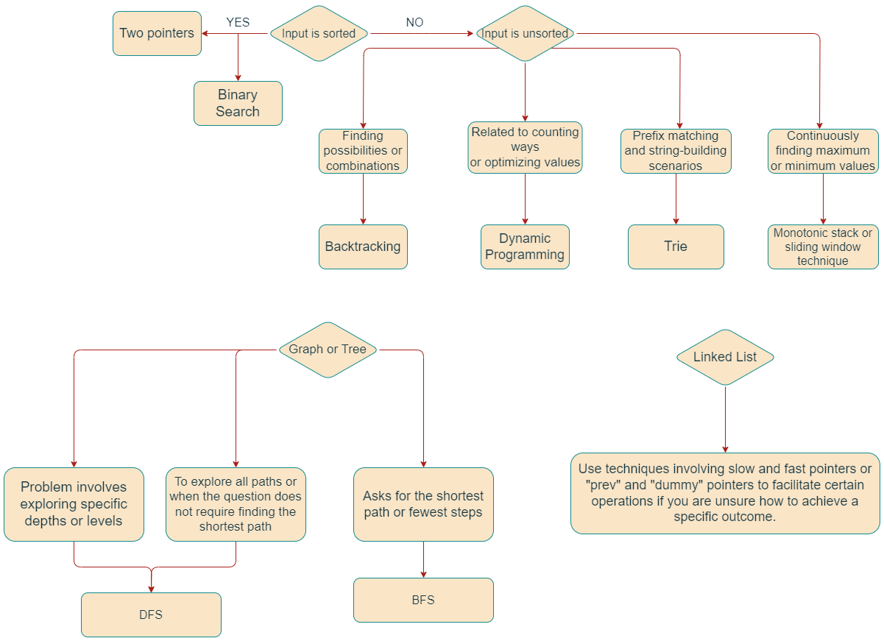

# Algorithm

Leetcode Practices Following [代码随想录](https://programmercarl.com/)

| Day  | 章节                | Part    | 题目数量                                                                                                                                                                                                         |
|------|-------------------|---------|--------------------------------------------------------------------------------------------------------------------------------------------------------------------------------------------------------------|
| Day 1 | 第一章 Array 数组      | part1 | 4 道题目                                                                                                                                                                                                        |
| Day 2 | 第一章 Array 数组      | part2 | 4 道题目                                                                                                                                                                                                        |
| Day 3 | 第二章 LinkedList 链表 | part1 | 4 道题目                                                                                                                                                                                                        |
| Day 4 | 第二章 LinkedList 链表 | part2 | 4 道题目                                                                                                                                                                                                        |
| Day 5 | Rest              | —       |  —                                                                                                                                                                                                  |
| Day 6 | 第三章 Hash 哈希表      | part1   | theory, [242.ValidAnagram](./3.Hash/242.ValidAnagram.md), [349.IntersectionOfTwoArrays](3.Hash/349.IntersectionOfTwoArrays.md), [202.HappyNumber](3.Hash/202.HappyNumber.md), [1.TwoSum](3.Hash/1.TwoSum.md) |
| Day 7 | 第三章 Hash 哈希表      | part2   | [454.4SumII](3.Hash/454.4SumII.md), [383.RansomNote](3.Hash/383.RansomNote.md), [15.3Sum](3.Hash/15.3Sum.md), [18.4Sum](3.Hash/18.4Sum.md), summary                                                          |
| Day 8 | 第四章 String 字符串    | part1 | 4 道题目                                                                                                                                                                                                        |
| Day 9 | 第四章 String 字符串    | part2 | 4 道题目                                                                                                                                                                                                        |
